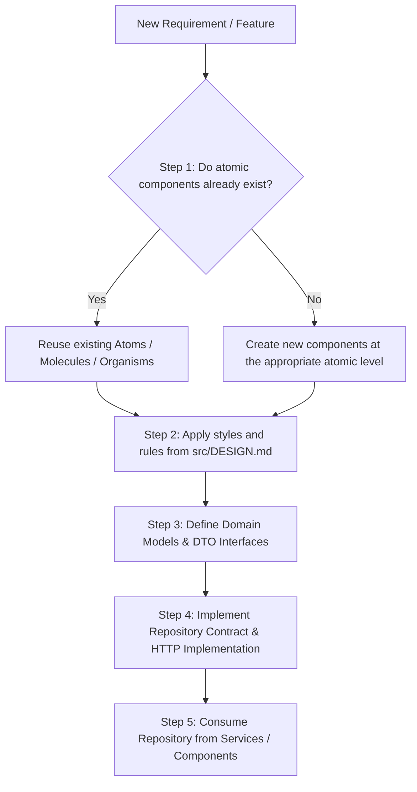

# Standard Development Guidelines

> **Mandatory Compliance Rule:** Every development task, feature addition, or refactoring in this project must strictly adhere to the three pillars defined in this document:
> 1. **Atomic Design** for UI component architecture and reuse.
> 2. **UI/UX Guidelines** defined in [`src/DESIGN.md`](./src/DESIGN.md) (Carbon Enterprise System).
> 3. **Repository Pattern** for the data layer and API consumption.

---

## Development Workflow

Before writing code for any feature, follow this sequential workflow:



---

## 1. Atomic Design (Component Architecture)

All user interface components must be classified and organized according to the **Atomic Design** methodology.

### 1.1. Reuse-First Principle
- **Before creating any component:** Always inspect the existing component catalog in `src/app/shared/components/` or within atomic folders.
- If a component already exists, reuse it or extend it via `@Input()` / `@Output()` or Signals without breaking backwards compatibility.
- Do not duplicate visual components or isolated styles.

### 1.2. Atomic Hierarchy

| Level | Description | Examples | Suggested Location |
| :--- | :--- | :--- | :--- |
| **Atoms** | Minimal, indivisible UI elements. Contain no business logic. | Button (`ButtonComponent`), Base Input (`InputComponent`), Badge, Icon, Label, Spinner. | `src/app/shared/components/atoms/` |
| **Molecules** | Combination of two or more atoms functioning together as a simple functional unit. | Form-Field (Label + Input + Error), Search Bar (Input + Icon + Button), User Avatar with name. | `src/app/shared/components/molecules/` |
| **Organisms** | Grouping of molecules and atoms that form complete, functional sections of the UI. | Data Table with pagination (`DataTableComponent`), Header/Navbar, Sidebar, Registration Form. | `src/app/shared/components/organisms/` |
| **Templates** | Layout structures and spatial arrangement (functional wireframes without hardcoded domain data). | Dashboard Layout, Auth Layout, Split Master-Detail Layout. | `src/app/shared/components/templates/` or `src/app/layouts/` |
| **Pages / Views** | Concrete instances integrating templates with real data and services/repositories orchestration (routed in Angular). | `UserManagementPage`, `DashboardPage`, `ToolsListPage`. | `src/app/features/[feature-name]/pages/` |

---

## 2. UI/UX Design Guidelines (`src/DESIGN.md`)

Every visual component and view must faithfully respect the design specifications based on **Carbon — Enterprise System ("Productive Clarity")**.

Always refer to the detailed specification in [`src/DESIGN.md`](./src/DESIGN.md). The critical design rules are summarized below:

### 2.1. Semantic Color Palette
- **Primary (`#0f62fe`):** IBM Blue — reserved for primary actions, buttons, links, and active states.
- **Background (`#ffffff`):** Pure white for optimal contrast.
- **Grayscale:** `#f4f4f4` (secondary backgrounds, cards, inputs) to `#161616` (primary text).
- **Success (`#198038`):** Data validation and positive completion states.
- **Danger (`#da1e28`):** Destructive actions, alerts, and error messages.
- *Rule:* Color roles are strictly semantic — never purely decorative.

### 2.2. Typography
- **Single Font Family:** `IBM Plex Sans`.
- **Hierarchy:** Established using font weights (`300` / `400` / `600`) rather than excessive size variations.
- **Base Sizes:** Body at `14px`, Labels at `12px`, Headings between `20px` and `32px`.
- **Rhythm & Grid:** `2px` increments for micro-spacing and a strict `8px` spacing grid (`8px`, `16px`, `24px`, `32px`...).

### 2.3. Elevation & Containers
- **Minimal Shadows:** Avoid heavy elevation. Use subtle Level 1 (`0 2px 6px rgba(0,0,0,0.1)`) or Level 2 (`0 4px 12px rgba(0,0,0,0.12)`).
- **Separators:** Prefer `border-bottom: 1px solid #e0e0e0` or subtle background shifts (`#f4f4f4`) over floating drop shadows.
- **Cards:** `#f4f4f4` background, `border-radius: 0` (clean straight edges according to Carbon), `16px` padding.

### 2.4. Component Conventions & Accessibility
- **Buttons:** Minimum touch target of `48px`. Primary (solid blue fill), Secondary (outlined), Ghost (text-only).
- **Inputs:** Bottom-border style, `40px` height, `#f4f4f4` background.
- **Data Tables:** Zebra striping with alternating `#f4f4f4` rows, high information density without visual clutter.
- **Accessibility:** Strict compliance with **WCAG AA** minimum contrast. Functional icons only — never purely ornamental.

---

## 3. Repository Pattern (API Consumption & Data Layer)

To ensure loose coupling, maintainability, and testability, **UI components must NEVER inject or call `HttpClient` directly**. All communication with external APIs or backend services must follow the **Repository Pattern**.

### 3.1. Layered Architecture

```
[ UI Component / Page ]
          │
          ▼
[ Application Service / State Store ] (Optional for complex UI state)
          │
          ▼
[ Repository Contract (Interface / Token) ]  <--- ToolRepository / TOOL_REPOSITORY
          │
          ▼
[ Repository Implementation ]                <--- ToolHttpRepository
          │
    ┌─────┴────────────────┐
    ▼                      ▼
[ HttpClient ]       [ Data Mappers / DTOs ]
```

### 3.2. Directory Structure by Domain / Feature

```
src/app/core/
  └── repositories/                  # Or inside features/[feature]/data/
      └── [domain]/
          ├── models/
          │   ├── [domain].model.ts        # Domain entity used across UI
          │   └── [domain].dto.ts          # Backend payload schema (if different)
          ├── mappers/
          │   └── [domain].mapper.ts       # DTO <-> Model conversion functions
          ├── [domain].repository.ts       # Abstract interface & InjectionToken contract
          └── [domain]-http.repository.ts  # Concrete HTTP implementation injecting HttpClient
```

### 3.3. Standard Implementation Example

#### 1. Domain Model (`tool.model.ts`)
```typescript
export interface Tool {
  id: string;
  name: string;
  description: string;
  category: string;
  isActive: boolean;
  createdAt: Date;
}
```

#### 2. Repository Contract & Injection Token (`tool.repository.ts`)
```typescript
import { Observable } from 'rxjs';
import { InjectionToken } from '@angular/core';
import { Tool } from './models/tool.model';

export interface ToolRepository {
  getAll(): Observable<Tool[]>;
  getById(id: string): Observable<Tool>;
  create(tool: Omit<Tool, 'id' | 'createdAt'>): Observable<Tool>;
  update(id: string, tool: Partial<Tool>): Observable<Tool>;
  delete(id: string): Observable<void>;
}

export const TOOL_REPOSITORY = new InjectionToken<ToolRepository>('TOOL_REPOSITORY');
```

#### 3. Concrete HTTP Implementation (`tool-http.repository.ts`)
```typescript
import { inject, Injectable } from '@angular/core';
import { HttpClient } from '@angular/common/http';
import { Observable, map } from 'rxjs';
import { ToolRepository } from './tool.repository';
import { Tool } from './models/tool.model';

@Injectable({
  providedIn: 'root',
})
export class ToolHttpRepository implements ToolRepository {
  private readonly http = inject(HttpClient);
  private readonly baseUrl = '/api/tools';

  getAll(): Observable<Tool[]> {
    return this.http.get<Tool[]>(this.baseUrl);
  }

  getById(id: string): Observable<Tool> {
    return this.http.get<Tool>(`${this.baseUrl}/${id}`);
  }

  create(tool: Omit<Tool, 'id' | 'createdAt'>): Observable<Tool> {
    return this.http.post<Tool>(this.baseUrl, tool);
  }

  update(id: string, tool: Partial<Tool>): Observable<Tool> {
    return this.http.put<Tool>(`${this.baseUrl}/${id}`, tool);
  }

  delete(id: string): Observable<void> {
    return this.http.delete<void>(`${this.baseUrl}/${id}`);
  }
}
```

#### 4. Dependency Injection Provider Configuration (`app.config.ts` or feature route providers)
```typescript
import { ApplicationConfig } from '@angular/core';
import { TOOL_REPOSITORY } from './core/repositories/tool/tool.repository';
import { ToolHttpRepository } from './core/repositories/tool/tool-http.repository';

export const appConfig: ApplicationConfig = {
  providers: [
    {
      provide: TOOL_REPOSITORY,
      useClass: ToolHttpRepository,
    },
  ],
};
```

#### 5. Consumption in Component / Service
```typescript
import { Component, inject, signal, OnInit } from '@angular/core';
import { TOOL_REPOSITORY } from '../../core/repositories/tool/tool.repository';
import { Tool } from '../../core/repositories/tool/models/tool.model';

@Component({
  selector: 'app-tool-list',
  standalone: true,
  templateUrl: './tool-list.component.html',
})
export class ToolListComponent implements OnInit {
  private readonly toolRepository = inject(TOOL_REPOSITORY);
  
  tools = signal<Tool[]>([]);
  isLoading = signal<boolean>(false);

  ngOnInit(): void {
    this.loadTools();
  }

  loadTools(): void {
    this.isLoading.set(true);
    this.toolRepository.getAll().subscribe({
      next: (data) => {
        this.tools.set(data);
        this.isLoading.set(false);
      },
      error: () => {
        this.isLoading.set(false);
      },
    });
  }
}
```

---

## 4. Best Practices & Quick Checklist

1. **No Inline Style Violations:** Never write arbitrary inline styles or classes that violate the color palette and spacing rhythm defined in `src/DESIGN.md`.
2. **Reuse Existing Atomic Components:** Always check for existing atoms, molecules, or organisms before creating new ones.
3. **Decouple UI from API:** Keep components clean by consuming repositories or state services instead of raw HTTP calls.
4. **Follow the 8px Spacing Grid:** Rely on `8px` spacing units and `IBM Plex Sans` typography with weight hierarchy.
5. **Ensure WCAG AA Accessibility:** Guarantee color contrast and a minimum touch target size of `48px` on interactive elements.
